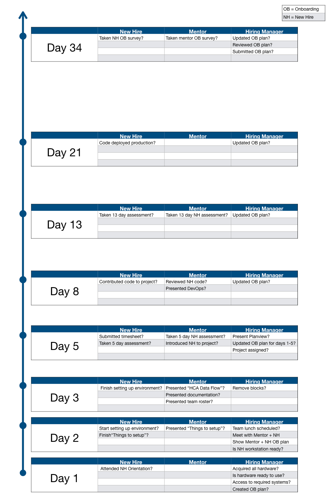

<!-- title:Timeline, description:A timeline with benchmarks-->
# Timeline
A major part of an onboard plan is the timeline. Every onboard plan has the same benchmark days and some common assessments especially early in the timeline.  Here is an example timeline for an engineering new hire:

